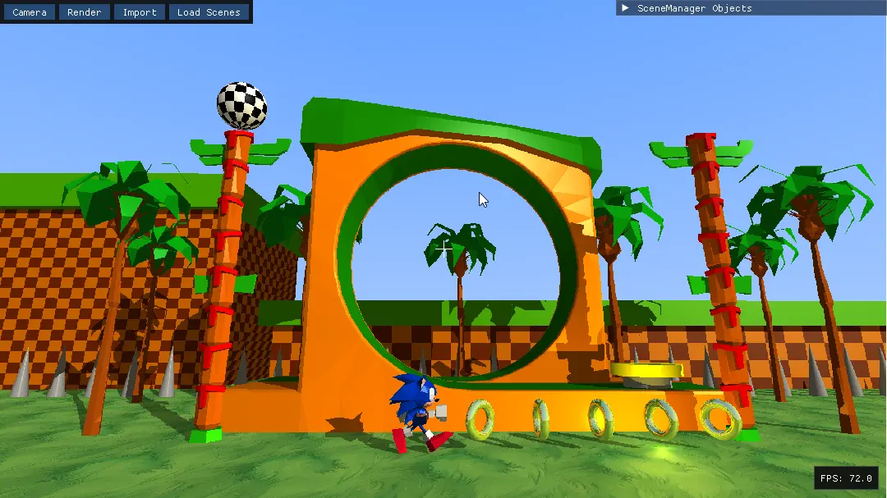

# Raytracing Engine with Modelling Features

This is a C++ raytracing engine developed as part of a computer graphics course. It demonstrates core raytracing concepts along with more advanced 3D modelling techniques like Constructive Solid Geometry (CSG) and Octrees. The engine features an interactive user interface built with ImGui and uses SDL2 for windowing and rendering the output.

## Features

*   **Raytracing Core:**
    *   Recursive raytracing implementation.
    *   Phong shading model for lighting calculations.
    *   Support for shadows.
    *   Basic reflections based on material properties.
*   **Geometry Primitives:**
    *   Sphere, Plane, Box (Mesh-based and CSG-based), Cylinder, Cone, Torus, Square Pyramid.
    *   Triangle Meshes with OBJ file loading support (including MTL materials).
*   **Acceleration:**
    *   Bounding Volume Hierarchy (BVH) for efficient ray intersection testing with complex scenes (especially meshes).
*   **Modelling & Scene:**
    *   **Constructive Solid Geometry (CSG):** Combine primitive shapes using Union, Intersection, and Difference operations.
    *   **Octrees:** Generate octree representations from geometric primitives for spatial partitioning and analysis (e.g., volume calculation).
    *   Scene management for objects and lights.
    *   Support for Point, Directional, and Spot lights.
*   **Materials & Textures:**
    *   Solid color materials with diffuse, specular, shininess, and reflection properties.
    *   Image textures loaded via stb_image.
    *   Procedural checkerboard textures.
*   **User Interface (ImGui):**
    *   Interactive camera controls (position, look-at, FOV, orthographic scale).
    *   Multiple camera projection modes (Perspective, Orthographic, Isometric).
    *   Control over background colors.
    *   Selection of different render modes (real-time low-res, low-res frame, high-res frame, disabled).
    *   Scene object hierarchy viewer: list, select, remove, and inspect objects.
    *   Object transformation controls (Translate, Rotate, Scale, Shear, Reflect) via UI.
    *   UI for adding new geometric primitives (Box, Sphere, Cylinder, Cone, Pyramid).
    *   UI for performing CSG boolean operations between selected objects.
    *   Octree generation controls and display of calculated volume/surface area.
    *   Light management: list, edit, add, remove lights.
    *   OBJ mesh importer UI.
    *   Pre-defined scene loading.
*   **Platform & Visualization:**
    *   SDL2 for window creation and displaying the rendered image.
    *   Optional wireframe overlay showing object bounding boxes and generated octree voxels.
    *   Optional world axes visualization.
    *   FPS counter.

## Screenshots





## Building the Project

The project uses CMake for building. Build scripts are provided for Linux/macOS.

### Prerequisites

**Linux (Debian/Ubuntu):**

1.  Ensure you have `build-essential`, `cmake`, `g++`.
2.  Install required libraries using the provided script:
    ```bash
    chmod +x install_deps.sh
    ./install_deps.sh
    ```
    This script installs `libsdl2-dev`, `libsdl2-ttf-dev`, and `libomp-dev`. For other Linux distributions, install the equivalent packages using your package manager.

**macOS:**

1.  Install CMake (e.g., via Homebrew: `brew install cmake`).
2.  Install SDL2 and SDL2_ttf (e.g., `brew install sdl2 sdl2_ttf`).
3.  Install OpenMP (e.g., `brew install libomp`). You might need to configure CMake to find it if installed via Brew.

**Windows:**

1.  Install CMake: [https://cmake.org/download/](https://cmake.org/download/)
2.  Install a C++ compiler, such as Visual Studio with the "Desktop development with C++" workload.
3.  SDL2 and SDL2_ttf libraries and headers are included in the `external/` directory for Windows builds. CMake should find them automatically. OpenMP support is typically included with Visual Studio compilers.

### Build Steps

**Linux / macOS (Using Build Script - Recommended):**

1.  Give the build script execution permissions:
    ```bash
    chmod +x build_release.sh
    ```
2.  Run the script:
    ```bash
    ./build_release.sh
    ```
    This will create a `build` directory, configure CMake for a Release build, and compile the project using `make`.

**Linux / macOS (Manual CMake):**

1.  Create a build directory:
    ```bash
    mkdir build
    cd build
    ```
2.  Configure CMake (specify Release build type for performance):
    ```bash
    cmake .. -DCMAKE_BUILD_TYPE=Release
    ```
3.  Compile the project:
    ```bash
    make -j$(nproc) # Adjust `nproc` based on your system/preferences
    ```

**Windows (Visual Studio):**

1.  Open CMake GUI or use the command line.
2.  Set the source code directory to the repository root.
3.  Set the build directory (e.g., a `build_vs` subdirectory).
4.  Click "Configure" and choose your Visual Studio generator (e.g., "Visual Studio 17 2022").
5.  Click "Generate".
6.  Open the generated `.sln` file in the build directory with Visual Studio.
7.  Select the "Release" configuration.
8.  Build the `RaytracerCG1` target (usually Build -> Build Solution).

## Running

*   After building, the executable (`RaytracerCG1` or `RaytracerCG1.exe`) will be located in the build directory (`build/` or `build_vs/Release/`).
*   The necessary assets (textures, fonts, models) will be automatically copied to the executable's directory during the build process (as configured in `CMakeLists.txt`).
*   Run the executable from your terminal or by double-clicking (on Windows):
    *   Linux/macOS: `./build/RaytracerCG1`
    *   Windows: `.\build_vs\Release\RaytracerCG1.exe`

Use the ImGui interface to interact with the scene, camera, and rendering options.

## Dependencies

*   C++17 Compiler
*   CMake (>= 3.16)
*   SDL2
*   SDL2_ttf
*   OpenMP (Optional, for parallel rendering)
*   ImGui (Included in `external/`)
*   stb_image (Included in `external/`)
